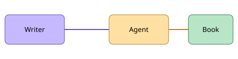

# The Internet

The internet was not designed. It accreted.

A protocol here, a convention there, each one solving a local problem for a handful of
researchers who never imagined that the same rules would one day carry a billion cat videos.

## Packets, not circuits

The telephone network reserved a physical path between two callers. The internet does
something stranger: it chops every message into packets and lets each one find its own way.

```text
message → [pkt 1][pkt 2][pkt 3] → many routes → reassembled
```

This sounds fragile. It turned out to be the most robust design decision of the century.

## A table of layers

| Layer | Job | Example |
|-------|-----|---------|
| Link | Move bits next door | Ethernet, Wi-Fi |
| Internet | Find the destination | IP |
| Transport | Deliver reliably | TCP |
| Application | Mean something | HTTP, email |



Read more in [the next chapter](03-ai.md).
